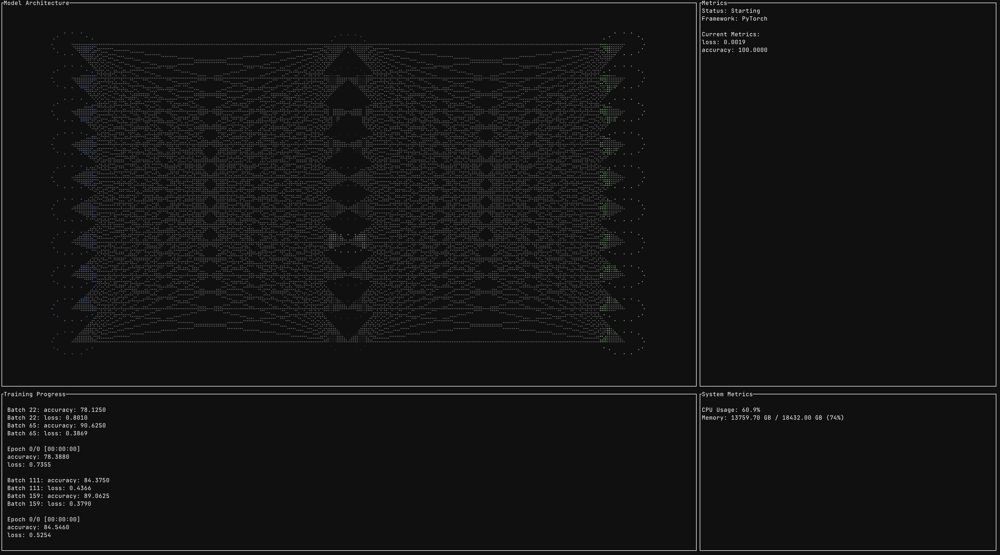
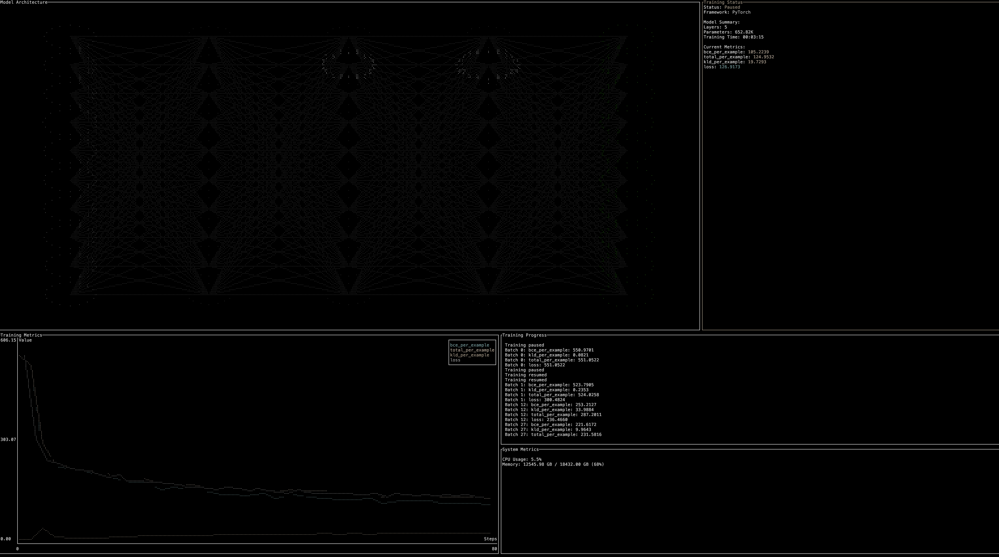
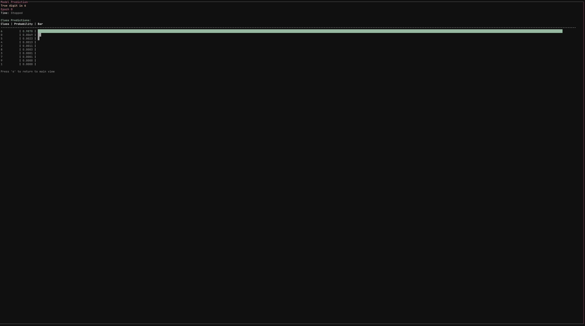
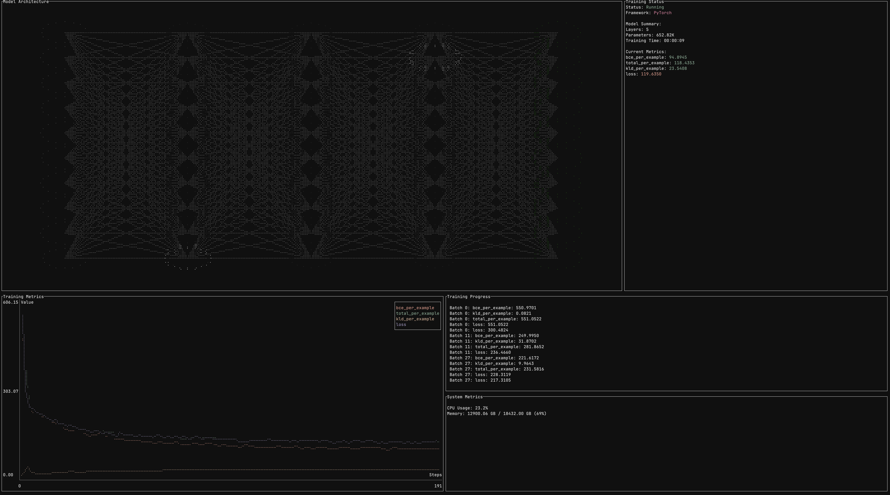
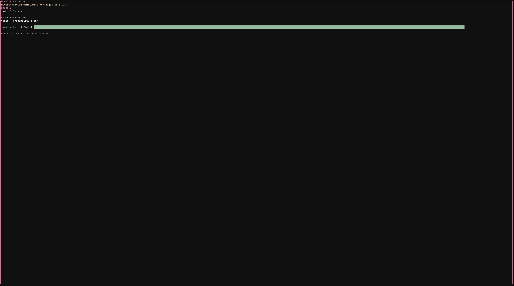

# Aliyah

---

Work in progress 

Being able to see to see my model train and interact with it in the terminal is important to me 

Wrapper libary in `/python`


```bash 
pip install aliyah 
```

---

## Installation 

Using package managers 
```bash 
cargo install aliyah # Rust CLI  
pip install aliyah # Python Hook Library  
```

Using curl 
```bash
curl -sSL https://raw.githubusercontent.com/lovechants/Aliyah/main/install.sh | bash
```

Using python 
```bash
python -m pip install aliyah
python -c "$(curl -sSL https://raw.githubusercontent.com/lovechants/Aliyah/main/install.py)"
```

From source 
```bash
git clone https://github.com/lovechants/Aliyah.git
cd Aliyah
cargo build --release
pip install -e python/
```

data folder is for example scripts only (if building from source)

---

## Quick Start 
After installing the tool and library you can add monitoring to your code very simply 


```python 
# Inside your training code
with trainingmonitor() as monitor:
    for epoch in range(epochs):
        for batch_idx, (data, target) in enumerate(train_loader):
            # Your training code
            loss = ...
            accuracy = ...
            
            # Log metrics
            monitor.log_batch(batch_idx, loss, accuracy)
            
            # Check if user paused/stopped
            if not monitor.check_control():
                break
        
        # Log epoch metrics
        monitor.log_epoch(epoch, val_loss, val_accuracy)
```

Keyboard Controls

q/ESC : Quit

p/SPACE: Pause/Resume training

s     : Stop training

e     : Toggle error log

↑/↓   : Scroll error log | Scroll training log 

c     : Clear error log

h     : Show this help

tab/n : Show node information 

click : Switch training and node panel

o     : Output panel 


You can visualize and track more data depending on what you decide is best to send and monitor 
Examples are provided that show in-depth metric tracking and visualization control in `/examples`
Full documentation for each function is in the works, for now you can look at the source code in the `/python` directory to see what you can send 

---

## Features

#### Real time visualization 
See real time visualization of your model architecture showing activations and connections between layers. Learn insights into each node and edge as the model learns. 

#### Trainign Metrics 
Monitor key metrics in accordance to your model in real time with an interactive log and real time chart. Custom metrics can be sent between both using `**KWARG` in associated functions

#### System Resource Monitoring 
Keep track of CPU, GPU, and memory usage while the model trainings

#### Interactive Control 
Pause, resume, or stop training wthout killing the process, allowing you to have real time control as your model trains. 

#### Real time prediction 
Check how your model is performing wiht the prediction panel as your model trains

---

## Framework Support 

✅ PyTorch
🚧JAX
🚧 TensorFlow/Keras
🚧 Scikit-Learn
🚧 TinyGrad

Contributions and suggestions to framework hooks and behaviors are appreciated 
Likewise, any framework that you'd like to see feel free to contribute or make an issue 

---

## Examples 

Checkout the examples for sample scripts and usage 

- `simpleNet.py` - A simple nerual network training on MNIST data, active visualizations and metric logging 
- `example_vae.py` - An example autoencoder adapted from PyTorch, showing custom metrics and active visualizations as well as custom prediction panel 
- `error_test.py` - Will show how the error log & are recorded in the TUI 

There are a variety of other scripts there for testing features feel free to look at them if using another framework outside of PyTorch 
###### Visualization hooks differ from framework to framework so as more get implemented better examples for each supported framework will be added 









---

## Current TODO 

- [x] Fix mouse input cature bug when you exit (if clicked)
- [x] Fix help render bug
- [x] Fix prediction timer bug
- [ ] Fix logging crash 
- [ ] Fix prediction screen text
- [x] Make plotting more robust
- [ ] Make visualization better for networks 
- [ ] Make classic machine learning visualizations (not just networks)
- [ ] Update examples (Make more robust examples with the new features and remove the original test examples)
    - [x] MNIST neural net 
    - [x] MNIST VAE 
    - [ ] Deep network 
    - [ ] Shallow network 
    - [ ] Transformer 
    - [ ] Algorithmic Pipeline -> PSO -> PNN (no boltzmann) [adapted from this paper](https://ieeexplore.ieee.org/document/6525976)
        - Either show each algorithm / model indepent of each other move to the next 
        - Or show all of them at the same time running async?
- [x] Test custom metrics
- [ ] Fix output match statements to be more robust (On pause or stopped script states) 
- [ ] Make framework hooks for visualizations 
    - [x] PyTorch 
    - [ ] JAX 
    - [ ] Keras
    - [ ] TF 
    - [ ] TinyGrad
    - [ ] SciKit Learn 
    - [ ] Custom 
    - [ ] Default 
- [ ] User Config 
- [ ] Publish Packages for pip, uv, and cargo 
- [ ] Add other GPU monitoring 
    - [ ] Test Metal 
    - [ ] Test NVIDIA 
    - [ ] Test AMD 
- [ ] Fix memory bug || check if its just local browser issues

---

Happy to release verion 0.1.0 
[PIP / PyPi](https://pypi.org/project/aliyah/0.1.0/)
[Cargo / Crates.io] (https://crates.io/crates/aliyah)
Roadmap to 1.0 alpha 

## 1. Core Infrastructure
- [x] Install and set up ZMQ dependencies (Rust and Python)
- [x] Create ZMQ context and socket management
- [x] Implement basic message patterns
  - [x] Command channel (REQ-REP)
  - [x] Metrics channel (PUB-SUB)
  - [x] Control flow channel

## 2. Python Monitor Library
- [x] Update monitor class for ZMQ
  - [x] Command handling
  - [x] Metric sending
  - [x] Control flow checks
- [ ] Context manager implementation
- [x] Error handling and recovery
- [x] Basic metric formatting
- [x] Safe cleanup on exit

## 3. Rust UI Updates
- [x] ZMQ socket integration
- [x] Command sending system
- [x] Metric receiving and parsing
- [x] Update existing UI components for new data flow
- [x] Error handling and connection management

## 4. Core Features for 0.1a
- [x] Training control (pause/resume/stop)
- [x] Basic metric display
  - [x] Loss
  - [x] Accuracy
  - [x] Epoch progress
- [x] Simple network visualization
- [x] Resource monitoring
  - [ ] Basic GPU stats
  - [x] Memory usage
  - [x] CPU usage

## 5. Testing and Validation
- [x] Basic integration tests
- [x] Cross-platform testing
- [x] Error recovery testing
- [x] Example scripts

## 6. Documentation
- [x] Usage guide
- [x] Example implementations
- [x] Installation instructions
- [x] Clean up codebase (again)

## Future Features (Post 1.0a)
- User configuration 
- Layer-specific visualization
- Advanced GPU monitoring
- Custom metric tracking
- Interactive parameter adjustment
- Extended framework support
- Advanced network visualization
- Custom algorithm support
